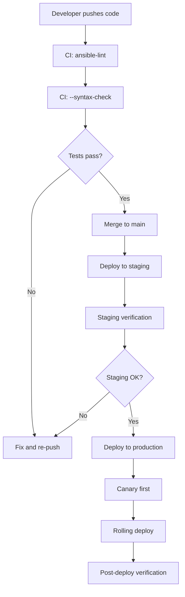

# Production Patterns

> Sources: Red Hat GPA, community production experience (2026)

## Deployment Flow



## Rolling Deployments

### Serial Keyword
Control how many hosts are updated at once:
```yaml
- name: Deploy application
  hosts: webservers
  serial: 3           # 3 hosts at a time
  max_fail_percentage: 0   # Stop if any fail
  tasks:
    - name: Update application
      ansible.builtin.copy:
        src: app-v2.tar.gz
        dest: /opt/app/app.tar.gz
      notify: restart app
      tags: [deploy]

    - name: Health check
      ansible.builtin.uri:
        url: "https://{{ inventory_hostname }}/health"
        return_content: yes
      register: health
      failed_when: "'healthy' not in health.content"
      tags: [deploy]
```

### Canary Deployments
```yaml
- name: Canary deployment
  hosts: prod_canary
  serial: 1
  tasks:
    - name: Deploy to canary
      ansible.builtin.include_role:
        name: app_deploy

- name: Full production deploy
  hosts: webservers:!prod_canary
  serial: "20%"
  tasks:
    - name: Deploy to rest
      ansible.builtin.include_role:
        name: app_deploy
```

## Multi-Stage Playbooks

### Orchestrator Playbook
```yaml
# site.yml - Main entry point
---
- name: Pre-flight checks
  ansible.builtin.import_playbook: playbooks/preflight.yml

- name: Base system setup
  ansible.builtin.import_playbook: playbooks/common.yml

- name: Deploy web servers
  ansible.builtin.import_playbook: playbooks/webservers.yml

- name: Deploy databases
  ansible.builtin.import_playbook: playbooks/databases.yml

- name: Post-deploy verification
  ansible.builtin.import_playbook: playbooks/verify.yml
```

### Stage Separation
```
playbooks/
├── 01-bootstrap.yml       # Initial server setup
├── 02-common.yml          # Common packages/configs
├── 03-database.yml        # Database installation
├── 04-webserver.yml       # Web server configuration
├── 05-application.yml     # Application deployment
└── 06-monitoring.yml      # Monitoring setup
```

## Configuration Management

### Environment Variable Separation
```yaml
# inventory/production/group_vars/all/vars.yml
---
app_name: myapp
app_user: myapp
app_group: myapp
app_home: /opt/myapp
app_log_dir: /var/log/myapp
nginx_worker_processes: 4
nginx_keepalive_timeout: 65

# inventory/production/group_vars/all/vault.yml
# Encrypted with ansible-vault
---
db_password: !vault |
  $ANSIBLE_VAULT;1.1;AES256
  623363...
```

### Jinja2 Templates with Variables
```jinja2
# roles/nginx/templates/nginx.conf.j2
worker_processes {{ nginx_worker_processes }};

events {
    worker_connections {{ nginx_worker_connections | default(1024) }};
}

http {
    keepalive_timeout {{ nginx_keepalive_timeout }};
    include /etc/nginx/conf.d/*.conf;
}
```

## Error Handling & Rollback

### Block/Rescue/Always for Rollback
```yaml
- name: Deploy with rollback
  block:
    - name: Backup current version
      ansible.builtin.archive:
        path: "{{ app_home }}/current"
        dest: "/tmp/app-backup-{{ ansible_date_time.epoch }}.tar.gz"
      tags: [deploy, backup]

    - name: Deploy new version
      ansible.builtin.unarchive:
        src: "app-{{ app_version }}.tar.gz"
        dest: "{{ app_home }}/current"

    - name: Restart service
      ansible.builtin.systemd:
        name: myapp
        state: restarted

    - name: Health check
      ansible.builtin.uri:
        url: "http://localhost:8080/health"
      register: health
      failed_when: health.status != 200

  rescue:
    - name: Rollback
      ansible.builtin.unarchive:
        src: "/tmp/app-backup-{{ ansible_date_time.epoch }}.tar.gz"
        dest: "{{ app_home }}/current"

    - name: Restart old version
      ansible.builtin.systemd:
        name: myapp
        state: restarted

  always:
    - name: Notify team
      ansible.builtin.uri:
        url: "{{ slack_webhook }}"
        method: POST
        body_format: json
        body:
          text: "Deployment completed for {{ inventory_hostname }}"
```

## Performance at Scale

### ansible.cfg for Large Deployments
```ini
[defaults]
forks = 50
host_key_checking = False
gathering = smart
fact_caching = jsonfile
fact_caching_connection = /tmp/ansible_facts_cache
fact_caching_timeout = 86400
pipelining = True
internal_poll_interval = 0.001
timeout = 30

[ssh_connection]
ssh_args = -o ControlMaster=auto -o ControlPersist=60s -o StrictHostKeyChecking=no
pipelining = True
control_path = /tmp/ansible-%%h-%%p-%%r
```

### Strategies
- `linear` (default): All hosts finish each task before moving to next
- `free`: Each host runs through tasks independently (faster but less ordered)
- `mitogen_linear`: Use Mitogen for 2-5x faster execution (external plugin)

### Fact Caching
```ini
# Cache facts to avoid re-gathering
gathering = smart
fact_caching = jsonfile
fact_caching_connection = /tmp/ansible_facts_cache
fact_caching_timeout = 86400

# Or use redis for shared cache across control nodes
# fact_caching = redis
```

## Pre-Flight Checklist

Before running against production:

1. **Idempotency**: Can every task be run twice without side effects? If `shell`/`command`, does it have `creates`, `removes`, or `changed_when`?
2. **Check mode**: Does `--check --diff` produce sensible output? Review diffs before applying.
3. **Canary first**: Has it run against a canary host successfully?
4. **Variables**: Are all required variables defined? Use `assert` for validation.
5. **Secrets**: Are passwords vault-encrypted? No plaintext secrets in Git?
6. **Rollback**: Is there a rollback plan if the deploy fails mid-roll?
7. **CI**: Has `ansible-lint` and `--syntax-check` passed?
8. **Serial**: Are `serial` and `max_fail_percentage` set for rolling deploys?
9. **Tags**: Can you run targeted subsets with `--tags`?
10. **Notifications**: Will the team be notified on failure?

## Common Production Anti-Patterns

| Anti-Pattern | Why It's Bad | Fix |
|---|---|---|
| `hosts: all` in prod | Accidentally targets everything | Use specific group names |
| Shell-heavy roles | Not idempotent, fragile | Use dedicated modules |
| Environment logic in tasks | Hard to maintain, test | Use `group_vars` per environment |
| Undocumented variable overrides | Impossible to debug | Document all overrides |
| Monolithic playbooks (500+ lines) | Unreadable, untestable | Refactor into roles |
| Hardcoded environment values | Breaks across environments | Use inventory vars |
| No check mode support | Can't dry-run | Add `check_mode: no` only when unavoidable |
